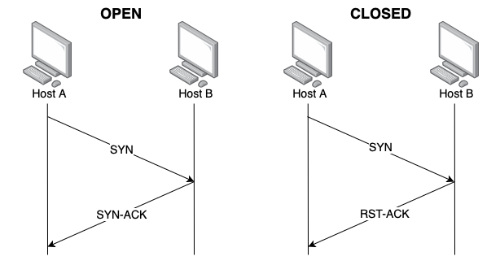
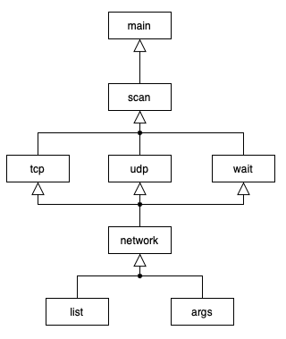
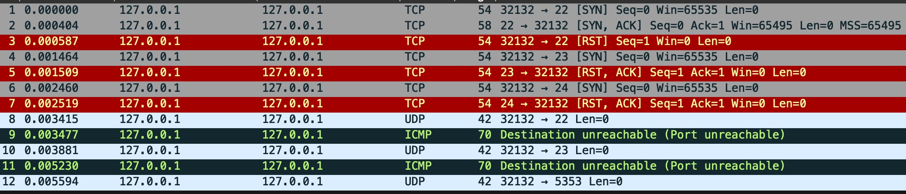
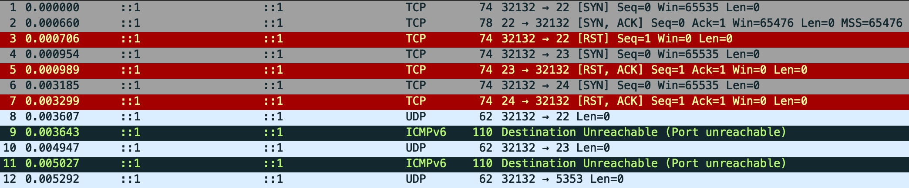

# IPK Project 1

## Introduction
This project is an L4 network scanner that detects the status of TCP and UDP ports on a specified host or IP address. The scanner resolves hostname into one or more IPv4/IPv6 addresses and uses sockets to send packets to target ports. Based on the responses, it determines whether:  

- **TCP ports** are **open**, **closed**, or **filtered**.  
- **UDP ports** are **closed** or **open**.  

The scanner runs on a specified network interface and can be terminated using `Ctrl + C`. 

## Table of Contents
- [IPK Project 1](#ipk-project-1)
    - [Table of Contents](#table-of-contents)
    - [Usage](#usage)
        - [Example Usage](#example-usage)
    - [Port Scanning](#port-scanning)
        - [TCP Scanning](#tcp-scanning)
        - [UDP Scanning](#udp-scanning)
        - [Checksum](#checksum)
    - [Implementation Overview](#implementation-overview)
        - [File Overview](#file-overview)
    - [Testing](#testing)
        - [Testing Enviroment](#testing-environment)
        - [Test Cases](#test-cases)
            - [Invalid Inputs](#invalid-inputs)
            - [Interface Listing](#interface-listing)
            - [Valid Inputs](#valid-inputs)
        - [Wireshark](#wireshark)
            - [IPv4](#ipv4)
            - [IPv6](#ipv6)
    - [Bibliography](#bibliography)

## Usage
The program can be compiled by running `make`, which will create the executable `ipk-l4-scan`. To perform scanning, the program needs to be executed using root privileges. There are multiple options that can be used; they are described below.
```
./ipk-l4-scan {-h | --help} [-i interface | --interface interface] [--pu port-ranges | --pt port-ranges | -u port-ranges | -t port-ranges] {-w timeout} [hostname | ip-address]
```
- `{}` - optional 
- `[]` - required

| Option | Description |
|--------|-------------|
| `-h`, `--help` | Prints usage instructions and exits. |
| `-i <interface>`, `--interface <interface>` | Specifies the network interface to scan through. If omitted or used without a value, a list of active interfaces is displayed. |
| `-t <ports>`, `--pt <ports>` | Specifies TCP port(s) to scan. Accepts a single port (`--pt 22`), a range (`--pt 1-65535`), or multiple ports (`--pt 22,23,24`). |
| `-u <ports>`, `--pu <ports>` | Specifies UDP port(s) to scan. Accepts a single port (`--pu 53`), a range (`--pu 1-65535`), or multiple ports (`--pu 53,67,123`). |
| `-w <timeout>`, `--wait <timeout>` | Sets the timeout (in milliseconds) to wait for a response per port scan. Default: `5000 ms` (5 seconds) if not specified. |
| `<hostname/IP>` | Target hostname or IP saddress to scan. |

### Example Usage
```
sudo ./ipk-l4-scan -i lo --pt 22,34,80 --pu 50-60 localhost -w 1000
```

## Port Scanning
A port scanning process involves sending requests to various ports on one or more hosts to identify open ports for specific services or to discover available services on the host.  While this technique can be useful for legitimate purposes, it can also be misused in attacks such as the SYN Flood. In a SYN Flood attack, the attacker sends many SYN segments to the host, creating half-open TCP connections because the ACK segment is never sent to complete the three-way handshake. This can lead to Denial of Service (DoS) for other users, preventing them from accessing the host.

### TCP Scanning
The SYN scanning method is used to scan TCP ports. This method sends a raw TCP segment where the SYN flag is set. The format of the TCP header is defined in RFC 793, as shown below.  
```
0                   1                   2                   3   
0 1 2 3 4 5 6 7 8 9 0 1 2 3 4 5 6 7 8 9 0 1 2 3 4 5 6 7 8 9 0 1 
+-+-+-+-+-+-+-+-+-+-+-+-+-+-+-+-+-+-+-+-+-+-+-+-+-+-+-+-+-+-+-+-+
|          Source Port          |       Destination Port        |
+-+-+-+-+-+-+-+-+-+-+-+-+-+-+-+-+-+-+-+-+-+-+-+-+-+-+-+-+-+-+-+-+
|                        Sequence Number                        |
+-+-+-+-+-+-+-+-+-+-+-+-+-+-+-+-+-+-+-+-+-+-+-+-+-+-+-+-+-+-+-+-+
|                    Acknowledgment Number                      |
+-+-+-+-+-+-+-+-+-+-+-+-+-+-+-+-+-+-+-+-+-+-+-+-+-+-+-+-+-+-+-+-+
|  Data |           |U|A|P|R|S|F|                               |
| Offset| Reserved  |R|C|S|S|Y|I|            Window             |
|       |           |G|K|H|T|N|N|                               |
+-+-+-+-+-+-+-+-+-+-+-+-+-+-+-+-+-+-+-+-+-+-+-+-+-+-+-+-+-+-+-+-+
|           Checksum            |         Urgent Pointer        |
+-+-+-+-+-+-+-+-+-+-+-+-+-+-+-+-+-+-+-+-+-+-+-+-+-+-+-+-+-+-+-+-+
|                    Options                    |    Padding    |
+-+-+-+-+-+-+-+-+-+-+-+-+-+-+-+-+-+-+-+-+-+-+-+-+-+-+-+-+-+-+-+-+
|                             data                              |
+-+-+-+-+-+-+-+-+-+-+-+-+-+-+-+-+-+-+-+-+-+-+-+-+-+-+-+-+-+-+-+-+
```
If an SYN-ACK segment is received, the port is open; when an RST segment is received, the port is closed; and if no response is received after sending the SYN segment twice, the port is marked as filtered. The Firewall can be causing this. The diagram below shows the SYN-ACK and RST responses.  



### UDP Scanning
UPD scanning is more challenging than TCP scanning since UDP is a connectionless protocol, so there is no equivalent to the TCP SYN packet.   UDP scanning is done by sending a UDP datagram to the specified port. If the port is closed, it replies with an ICMP port unreachable message. Open ports do not send any response due to the nature of the UDP protocol, so when the Firewall blocks ICMP messages, all ports can mistakingly appear as open. The format of the UDP header is defined in RFC 768, as shown below.
```
 0      7 8     15 16    23 24    31
+--------+--------+--------+--------+
|     Source      |   Destination   |
|      Port       |      Port       |
+--------+--------+--------+--------+
|                 |                 |
|     Length      |    Checksum     |
+--------+--------+--------+--------+
```

### Checksum
A checksum is included in both TCP and UDP headers for error detection. It determines if the packet has been altered as it moved from source to destination. The checksum is calculated as the 1's complement of the sum of all 16-bit words in the segment, with any overflow encountered during the sum being wrapped around. A pseudo-header is prefixed to the relevant header to compute the checksum for either the UDP or TCP header. The IPv4 pseudo header includes the following fields according to RFC 793: 
```
+--------+--------+--------+--------+
|           Source Address          |
+--------+--------+--------+--------+
|         Destination Address       |
+--------+--------+--------+--------+
|  zero  |  PTCL  |    TCP Length   |
+--------+--------+--------+--------+
```

The IPv6 pseudo header has a slightly different structure defined in RFC 8200, which consists of:
```
+-+-+-+-+-+-+-+-+-+-+-+-+-+-+-+-+-+-+-+-+-+-+-+-+-+-+-+-+-+-+-+-+
|                                                               |
+                                                               +
|                                                               |
+                         Source Address                        +
|                                                               |
+                                                               +
|                                                               |
+-+-+-+-+-+-+-+-+-+-+-+-+-+-+-+-+-+-+-+-+-+-+-+-+-+-+-+-+-+-+-+-+
|                                                               |
+                                                               +
|                                                               |
+                      Destination Address                      +
|                                                               |
+                                                               +
|                                                               |
+-+-+-+-+-+-+-+-+-+-+-+-+-+-+-+-+-+-+-+-+-+-+-+-+-+-+-+-+-+-+-+-+
|                   Upper-Layer Packet Length                   |
+-+-+-+-+-+-+-+-+-+-+-+-+-+-+-+-+-+-+-+-+-+-+-+-+-+-+-+-+-+-+-+-+
|                      zero                     |  Next Header  |
+-+-+-+-+-+-+-+-+-+-+-+-+-+-+-+-+-+-+-+-+-+-+-+-+-+-+-+-+-+-+-+-+
```

## Implementation Overview

This section describes the project's implementation details, including its structure, key components, and how different files interact to perform network scanning.

The project is implemented in **C** and has a modular structure. The source files are in `src/`, and their corresponding header files are in `lib/`. Below is a diagram illustrating how the files are structured within the project, showing their relationships and interactions.



### File Overview
This section describes the contents and responsibilities of the project files:
- **main.c**: Program's main entry, processing arguments and coordinating execution.
- **scan.c**: Implements `scan_ports` function to iterate across TCP and UDP ports.
- **tcp.c**: Handles sending and receiving TCP messages.
- **udp.c**: Handles sending and receiving UDP messages.
- **wait.c**: Manages timeout when waiting for a response.
- **network.c**: Handles sockets, checksum calculations, and network setup.
- **list.c**: Implements a simple list for deduplication.
- **args.c**: Processes and validates command-line arguments.

## Testing
The testing process ensures the scanner functions correctly across different scenarios, including handling valid and invalid inputs and comparing results against `nmap`.

### Testing Environment
- **Host Machine**: MacBook running Lima (`limactl version 0.23.2`).
- **Test VM**: Referential virtual machine with nix shell setup.
- **Tools Used**: 
  - `ipk-l4-scan` (scanner being tested)
  - `nmap` (for comparison)
  - Python-based test script

### Test Cases
- #### Invalid Inputs
    - **Objective**: Ensure the scanner properly rejects incorrect arguments.
    - **Expected Outcome**: The scanner should return an error for each invalid input.

- #### Interface Listing
    - **Objective**: Verify that the scanner correctly lists active network interfaces.
    - **Expected Outcome**: The lists of active interfaces should match `ifconfig`.

- #### Valid Inputs
    - **Objective**: Confirm correct detection of open, closed, and filtered ports.
    - **Expected Outcome**: The scanner's output should match `nmap`.

### Wireshark
Used to analyze packets sent and received by the scanner. Wireshark helps to verify that the scanner is sending the correct packets and receiving the expected responses.
#### IPv4
**Execution**: `sudo ./ipk-l4-scan -i lo -t 22,23,24 -u 22,23,5353 localhost`  



#### IPv6
**Execution**: `sudo ./ipk-l4-scan -i lo -t 22,23,24 -u 22,23,5353 ::1`  



## Bibliography
- **[RFC9293]** Eddy, W. _Transmission Control Protocol (TCP)_ [online]. August 2022. [cited 2025-03-20]. DOI: 10.17487/RFC9293. Available at: https://datatracker.ietf.org/doc/html/rfc9293
- **[RFC768]** Postel, J. _User Datagram Protocol_ [online]. March 1997. [cited 2024-03-21]. DOI: 10.17487/RFC0768. Available at: https://datatracker.ietf.org/doc/html/rfc768
- **[RFC8200]** Deering, S. and Hinden, R. _Internet Protocol, Version 6 (IPv6) Specification_ [online]. July 2017. [cited 2024-03-21]. DOI: 10.17487/RFC8200. Available at: https://datatracker.ietf.org/doc/html/rfc8200
- **[Wikipedia]** Wikipedia contributors. _Port scanner_ [online]. 2025. [cited 2025-03-21]. Available at: [https://en.wikipedia.org/w/index.php?title=Port_scanner&oldid=1225200572](https://en.wikipedia.org/w/index.php?title=Port_scanner&oldid=1225200572)
- **Kurose, J. F., and Ross, K. W.** _Computer Networking: A Top-Down Approach_. 6th ed., Pearson, 2013. ISBN: 0-273-76896-4.

